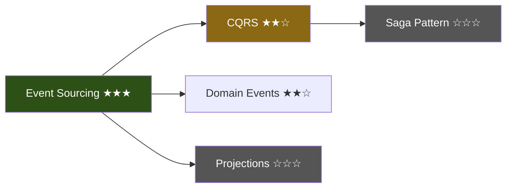

# Neocortex 知识库进化设计

> 受 Andrej Karpathy "LLM Knowledge Bases" 启发，将 Neocortex 从「笔记工具」升级为「个人知识库」。
>
> Karpathy 的原话：*"I think there is a strong product to be made here, not just a hack of scripts."*
> Neocortex 已经有了闭环学习、技能校准、个性化笔记——这些 Karpathy 的脚本完全没有。
> 补上「概念编译」这一层，就是他说的那个产品。

---

## 1. 现状与差距

### Neocortex 已有

| 能力 | 对应模块 | 状态 |
|---|---|---|
| 内容摄取（URL/PDF/EPUB/微信） | `reader/fetcher.py` | ✅ |
| 个性化笔记生成 | `reader/teacher.py` | ✅ |
| Obsidian 兼容输出 | `cmd_read.py` (frontmatter + Mermaid) | ✅ |
| 全文搜索 + 向量检索 | `search.py` (FTS5 + fastembed) | ✅ |
| 个性化问答 | `asker.py` (ask/chat) | ✅ |
| 闭环追踪 | `tracker.py` + `config.py` | ✅ |
| 学习路径推荐 | `recommender.py` | ✅ |
| 认知收敛 | `converger.py` | ✅ |
| 视觉卡片 | `reader/card.py` | ✅ |
| 技能校准 | `prober.py` + calibration | ✅ |

### Karpathy 工作流中我们缺的

| 缺失能力 | 影响 | 优先级 |
|---|---|---|
| **概念编译层** — 跨笔记聚合为互联的概念 wiki | 笔记是孤岛，没有知识网络 | P0 |
| **知识索引** — LLM 自维护的语义目录 | 问答只能靠 FTS5，没有全局知识地图 | P0 |
| **问答沉淀** — ask/chat 输出回流知识库 | 探索产出即丢失，不积累 | P1 |
| **知识健康检查** — 矛盾检测、覆盖分析、连接发现 | 知识库质量无人维护 | P1 |
| **丰富输出** — slides、概念图可视化 | 输出形式单一 | P2 |

---

## 2. 设计目标

1. **知识 > 笔记**：单篇笔记是原材料，概念条目才是知识资产
2. **增量编译**：每次 `read` 后自动更新受影响的概念，不需要手动触发全量编译
3. **零手工维护**：INDEX.md、概念条目、双向链接全由 LLM 写和维护，用户只需阅读
4. **与已有系统深度集成**：概念 = gap 的知识化身，编译结果直接驱动推荐和校准
5. **Obsidian 原生**：所有产出都是纯 Markdown + wikilinks，Obsidian 图谱视图直接可用
6. **渐进增强**：不改变现有工作流，新功能是叠加而非替换

---

## 3. 架构概览

```
┌─────────────────────────────────────────────────────────┐
│                      用户工作流                           │
│  read → compile → ask/chat → lint → recommend → read    │
│         ↑ 自动      ↑ 沉淀     ↑ 健康                    │
└──────┬──────────────┬─────────┬──────────────────────────┘
       │              │         │
┌──────▼──────┐ ┌─────▼───┐ ┌──▼───────────┐
│   编译引擎   │ │ 沉淀引擎 │ │   健检引擎    │
│ compiler.py │ │ (扩展    │ │  linter.py   │
│             │ │  asker)  │ │              │
└──────┬──────┘ └─────┬───┘ └──────────────┘
       │              │
┌──────▼──────────────▼──────────────────────┐
│              知识库（笔记目录）                │
│  *.md          笔记（现有）                   │
│  concepts/     概念条目（新增）                │
│  insights/     问答沉淀（新增）                │
│  INDEX.md      语义目录（新增）                │
└────────────────────────────────────────────┘
       │
┌──────▼──────────────────┐
│   已有系统               │
│  gap_progress.json      │ ← 概念证据驱动 gap 状态迁移
│  recommendations.json   │ ← 概念覆盖率影响推荐
│  neocortex.sqlite       │ ← 概念条目也进 FTS5 索引
│  profile.json           │ ← 概念掌握度更新 skills
└─────────────────────────┘
```

### 目录结构变化

```
~/Documents/Neocortex/          （笔记目录，现有 + 新增）
├── INDEX.md                    # 新增：LLM 自维护的知识地图
├── *.md                        # 现有：阅读笔记（不动）
├── concepts/                   # 新增：概念条目
│   ├── event-sourcing.md
│   ├── cqrs.md
│   └── ...
└── insights/                   # 新增：问答沉淀
    ├── 2026-04-03-crdt-vs-ot.md
    └── ...
```

---

## 4. 详细设计

### 4.1 概念编译层（`compiler.py`，新增命令 `neocortex compile`）

**核心思路**：扫描所有笔记，提取概念，为每个概念生成一个 wiki 条目，建立双向链接。

#### 4.1.1 概念提取

从每篇笔记中提取概念列表。一次 LLM 调用处理一篇笔记：

```
输入：笔记内容（前 3000 字）+ frontmatter tags
输出：[{name, definition_brief, relationship_to: [other_concepts]}]
```

概念名称经过 `normalize_gap_name()` 规范化（复用现有 gap 同义词系统），确保 "Event Sourcing"、"event sourcing"、"ES" 都归一为同一个概念。

#### 4.1.2 概念条目格式

```markdown
---
type: concept
name: Event Sourcing
aliases: [event-sourcing, ES, 事件溯源]
related_concepts: [CQRS, Domain Events, Event Store]
skill_level: proficient
confidence: 0.6
evidence_count: 5
last_updated: 2026-04-03
---

# Event Sourcing

## 一句话理解
不存最终状态，只存每一步变化——就像 git log 比 working tree 更有价值。

## 核心要点
- [从多篇笔记聚合的关键知识点]
- [跨笔记出现的共识和分歧]

## 来源笔记
- [[event-sourcing-explained-2026-03-15]] — 基础介绍，Martin Fowler 的定义
- [[building-event-stores-2026-03-20]] — 实现细节，PostgreSQL 方案
- [[microservices-patterns-2026-03-25]] — 在微服务中的应用

## 关联概念
- [[CQRS]] — 常配合使用，读写分离
- [[Domain Events]] — 事件溯源的基本单元
- [[Saga Pattern]] — 跨服务事务补偿

## 开放问题
- Event Store 的快照策略？多久打一次？
- 与传统 CRUD 的渐进迁移路径？

## 从你的项目看
- 你在 neocortex 项目中用了类似思路：profile 变更不是覆盖写入，而是通过 gap_progress 追踪状态变迁
```

#### 4.1.3 编译模式

**增量编译**（每次 `read` 后自动触发）：

```
新笔记写入
  → 提取该笔记涉及的概念（1 次 LLM 调用）
  → 对每个概念：
     ├─ 已有条目 → 追加来源笔记、更新要点（1 次 LLM 调用 / 概念）
     └─ 新概念 → 创建条目（1 次 LLM 调用）
  → 更新 INDEX.md 中对应的条目行
  → 在笔记中插入 [[wikilinks]]
```

**全量编译**（`neocortex compile`，手动触发）：

```
扫描所有笔记 + insights
  → 批量提取概念（可合并多篇笔记到一次调用）
  → 重新生成所有概念条目
  → 发现跨概念关系
  → 重建 INDEX.md
  → 全量插入 wikilinks
```

**编译缓存**：在 `~/.neocortex/compile_cache.json` 存储每篇笔记的 content hash。增量编译时只处理 hash 变化的笔记。全量编译忽略缓存。

#### 4.1.4 Wikilink 插入策略

在笔记正文中，将概念名称（及其别名）替换为 `[[概念名称]]` 格式。规则：

- 只替换首次出现（避免满篇链接）
- 不替换代码块、frontmatter、标题中的文本
- 使用概念的 `aliases` 列表做匹配
- 插入后笔记仍然是合法 Markdown（Obsidian 渲染 wikilinks，普通编辑器显示为 `[[text]]`）

#### 4.1.5 与 gap 系统集成

概念条目和 gap 是同一事物的两面：

```
gap（画像中的盲区） ←→ concept（知识库中的条目）
```

映射规则：
- 概念的 `evidence_count`（来源笔记数）驱动 gap 状态迁移：
  - 0 篇笔记 → gap
  - 1-2 篇笔记 → learning
  - 3+ 篇笔记且通过 Socratic probe → known
- 概念的 `skill_level` 和 `confidence` 同步到 profile 对应的 skill
- 新发现的概念如果不在 gap 列表中 → 新增为 gap（状态为 "learning"，因为已有一篇笔记）

这让现有的闭环（recommend → read → track gap）多了一条通路：概念积累自动推进 gap 状态，不再完全依赖 tracker 的手动匹配。

---

### 4.2 知识索引（`INDEX.md`）

LLM 自维护的知识地图。这是 Karpathy 发现的关键洞察：**不需要复杂 RAG，LLM 维护的索引文件 + 每篇文档的简要摘要就够了**。

#### 4.2.1 INDEX.md 格式

```markdown
# Knowledge Base

> 42 notes | 15 concepts | 8 insights | Last updated: 2026-04-03

## Concept Map

### 分布式系统
- [[Event Sourcing]] ★★★ — 5 notes — 不存状态存变化
- [[CQRS]] ★★☆ — 2 notes — 读写模型分离
- [[Saga Pattern]] ☆☆☆ — 0 notes — 跨服务事务（待探索）

### 前端工程
- [[React Server Components]] ★☆☆ — 1 note — 服务端渲染组件
- [[Streaming SSR]] ☆☆☆ — 0 notes — 流式服务端渲染（待探索）

### AI/ML
- [[RAG]] ★★☆ — 3 notes — 检索增强生成
- [[Fine-tuning]] ★☆☆ — 1 note — 模型微调

## Recent Activity
- 2026-04-03: 阅读「Event Sourcing in Practice」→ 更新 [[Event Sourcing]]、新建 [[Event Store]]
- 2026-04-02: 问答「CRDT vs OT 的取舍」→ 保存为 insight
- 2026-04-01: 阅读「React 19 新特性」→ 新建 [[React Server Components]]

## Coverage Summary
- 15 concepts total: 4 mastered, 6 learning, 5 gaps
- 3 domains active: 分布式系统 (7), 前端 (5), AI/ML (3)
- Strongest cluster: 分布式系统 — 形成了 Event Sourcing → CQRS → Saga 的知识链
- Weakest gap: Streaming SSR — 出现在 3 篇笔记中但没有专门学习
```

#### 4.2.2 更新策略

- 增量编译时：只更新受影响的概念行 + Recent Activity
- 全量编译时：重新生成整个文件
- INDEX.md 的星级（★）反映 gap 状态：★★★ = known, ★★☆ = learning, ★☆☆ = 有笔记但未掌握, ☆☆☆ = gap

#### 4.2.3 用于增强问答

现有 `ask`/`chat` 的问答只用了 profile 做上下文。增强后：

```
用户提问
  → 读 INDEX.md，定位相关概念
  → 读取相关概念条目（每个条目很短，1-2KB）
  → 如果需要更多细节，读取概念链接的具体笔记
  → 带着完整知识上下文生成回答
```

这就是 Karpathy 说的 "LLM 在 ~100 篇文章规模下不需要 RAG"——INDEX.md 就是导航图，概念条目是摘要层，具体笔记是原始层。三层结构让 LLM 高效定位信息。

---

### 4.3 问答沉淀

**目标**：`ask`/`chat` 的有价值回答不再消失在终端里，而是沉淀为知识库的一部分。

#### 4.3.1 `ask` 命令扩展

```python
# 现有行为：打印回答后结束
# 新增行为：
#   1. 打印回答
#   2. 提示 "Save to knowledge base? [y/n/auto]"
#   3. 如果 yes → 保存为 insights/*.md
#   4. 触发增量编译
```

新增 `--save` flag 跳过确认直接保存。新增配置项 `auto_save_insights: bool = False`，开启后自动保存所有问答。

#### 4.3.2 `chat` 命令扩展

Chat session 结束时：

```python
# 现有行为：直接退出
# 新增行为：
#   1. 统计对话中有价值的问答对（排除闲聊）
#   2. 如果有价值内容 > 0，提示 "Save N insights? [y/n]"
#   3. 保存为 insights/*.md（一个对话一个文件，或每个问答对一个文件）
#   4. 触发增量编译
```

#### 4.3.3 Insight 文件格式

```markdown
---
type: insight
question: "CRDT 和 OT 在协同编辑中怎么选？"
date: 2026-04-03
source: ask
related_concepts: [CRDT, OT, Collaborative Editing]
tags:
  - distributed-systems
  - real-time-collaboration
---

# CRDT 和 OT 在协同编辑中怎么选？

[LLM 生成的回答内容]

## 关键结论
- [从回答中提取的核心要点]
```

Insight 参与概念编译（和普通笔记一样），但在 INDEX.md 中标记来源为 "探索" 而非 "阅读"。

---

### 4.4 知识健康检查（`linter.py`，新增命令 `neocortex lint`）

**目标**：让 LLM 对整个知识库做质检，发现问题、补全缺失、挖掘关联。

#### 4.4.1 检查项

| 检查类型 | 说明 | 实现方式 |
|---|---|---|
| **矛盾检测** | 同一概念在不同笔记中的冲突说法 | LLM 对比同概念下的多篇笔记摘要 |
| **孤岛笔记** | 没有关联到任何概念的笔记 | 扫描笔记，检查是否有 wikilinks 或 tags 匹配概念 |
| **陈旧概念** | 概念条目的来源笔记已更新但条目未同步 | 比较笔记 mtime 和概念 last_updated |
| **缺失连接** | 两个概念频繁共现于同一笔记但未建立关联 | 统计概念共现矩阵，找高共现但未 link 的对 |
| **覆盖盲区** | 用户有 gap 但没有任何笔记覆盖该领域 | 交叉比对 profile.gaps 和概念条目 |
| **深度不足** | 概念有多篇笔记但都是浅层（outline 全是 brief） | 检查笔记的 outline marker 分布 |
| **断裂链接** | wikilinks 指向不存在的文件 | 扫描所有 `[[...]]`，检查目标文件存在性 |
| **重复概念** | 同一概念以不同名字出现 | 复用 `_GAP_SYNONYMS` + LLM 语义去重 |
| **建议探索** | 基于已有概念发现值得探索的交叉领域 | LLM 分析概念图谱，提出"你学了 X 和 Y，它们的交集 Z 值得看看" |

#### 4.4.2 输出格式

```
$ neocortex lint

  Knowledge Base Health Report
  ━━━━━━━━━━━━━━━━━━━━━━━━━━━━━━━━━━━━━━━━━━━━━

  Score: 72/100

  ❌ Contradictions (2)
     • Event Sourcing: 笔记 A 说 "快照每 100 事件打一次"，笔记 B 说 "快照在查询时按需生成"
       → 建议：阅读 Greg Young 的原始论文确认

  ⚠️ Orphan Notes (3)
     • python-tips-2026-03-10.md — 无关联概念
     • ...

  ⚠️ Coverage Gaps (4)
     • Streaming SSR — 出现在 3 篇笔记中但没有专门条目
     • WebSocket — profile 中标为 gap，知识库中零覆盖

  💡 Suggested Explorations (2)
     • 你学了 Event Sourcing 和 CQRS，但没探索过 Projection Rebuilding
     • CRDT 和 Saga Pattern 都涉及最终一致性，值得对比研究

  ✅ Healthy (8)
     • 15 concepts all have sources
     • No broken wikilinks
     • ...
```

#### 4.4.3 自动修复

`lint` 默认只报告。加 `--fix` flag 自动修复可修的问题：

- 断裂链接 → 删除或创建空概念条目
- 陈旧概念 → 触发增量重编译
- 孤岛笔记 → 尝试提取概念并建立链接
- 重复概念 → 合并（需用户确认）

矛盾检测和建议探索只报告，不自动修复——这些需要用户判断。

#### 4.4.4 与 converge 的关系

现有 `converge` 命令关注的是"这段时间我学了什么，有什么交叉和盲区"——是**时间维度**的总结。

新增 `lint` 关注的是"我的整个知识库健康吗"——是**空间维度**的质检。

两者互补，不替代。长远来看，`lint` 的发现可以作为 `converge` 报告的输入，让收敛报告更准确。

---

### 4.5 增强输出格式

#### 4.5.1 概念图可视化（`neocortex map`）

生成知识库的概念关系图（Mermaid 格式），输出为 Markdown 文件：



支持参数：
- `neocortex map` — 全局概念图
- `neocortex map --domain "分布式系统"` — 按领域筛选
- `neocortex map --around "Event Sourcing"` — 某概念的关联网络

输出为 `~/Documents/Neocortex/maps/concept-map-YYYY-MM-DD.md`，Obsidian 可直接渲染。

#### 4.5.2 学习周报（`neocortex digest`）

在现有 `converge` 的基础上增加结构化输出：

```markdown
# 学习周报 2026-W14

## 本周数据
- 阅读：5 篇文章
- 新概念：3 个（Event Store, Projection, Snapshot）
- 概念升级：Event Sourcing gap → learning → known ✓
- 问答探索：2 次
- 知识库健康：72/100 → 78/100

## 知识网络变化
[Mermaid diff 图：本周新增的概念和连接高亮]

## 本周洞察
[从 converge 引擎生成]

## 下周建议
[从 lint 的 suggested explorations + recommender 生成]
```

#### 4.5.3 Slides 导出（`neocortex slides`，P2）

将概念条目或笔记转为 Marp 格式的 slides：

```markdown
---
marp: true
theme: default
---

# Event Sourcing

不存最终状态，只存每一步变化

---

## 核心原理

- 每个状态变更 = 一个不可变事件
- 当前状态 = 所有事件的累积
- 类比：git log > working tree

---

## 从你的项目看

Neocortex 的 gap_progress 就是简化版 Event Sourcing：
- 每次 read 是一个事件
- gap → learning → known 是状态重建

---
```

Obsidian 的 Marp 插件可直接渲染和演示。

---

## 5. 与现有系统的集成

### 5.1 `read` 命令（`cmd_read.py`）

**改动点**：在笔记保存和索引之后，增加编译步骤。

```python
# 现有流程（不变）：
#   fetch → outline → generate_notes → save → index → match_recommendation → feedback

# 新增步骤（在 index 之后）：
#   → compile_note(note_path)  # 提取概念、更新/创建条目、更新 INDEX.md
```

用户无感知，编译在后台完成。如果编译失败（LLM 错误等），不影响现有流程，只是这篇笔记的概念未被提取。下次 `neocortex compile` 全量编译时会补上。

### 5.2 `ask`/`chat` 命令（`cmd_knowledge.py`）

**改动点**：

1. **问答增强**：在构建 system prompt 时，加载 INDEX.md + 相关概念条目作为上下文
2. **沉淀**：回答后提供保存选项
3. **保存后触发增量编译**

```python
# 现有 ask 流程：
#   load_profile → create_provider → ask_question(question, profile) → print

# 增强后：
#   load_profile → create_provider
#   → load INDEX.md + 相关概念（新增）
#   → ask_question(question, profile, knowledge_context)  # 签名变化
#   → print
#   → prompt save? → save_insight() → compile_note()  # 新增
```

### 5.3 `recommend` 命令（`cmd_learn.py`）

**改动点**：推荐上下文增加知识库状态。

```python
# 现有 _build_context() 包含：persona, gaps, completed, recently_read
# 新增：concept_coverage — 每个概念的掌握度和笔记数量
```

这让推荐器知道"用户虽然还没完成推荐，但已经自己读了相关文章"，避免重复推荐。

### 5.4 `converge` 命令（`cmd_learn.py`）

**改动点**：收敛报告的输入增加概念图谱信息。

```python
# 现有输入：recent notes
# 新增输入：concepts 目录下的条目、INDEX.md 的 coverage summary
```

这让收敛报告能说"你在分布式系统领域形成了 3 个概念的知识链"，而不只是"你读了 5 篇文章"。

### 5.5 `index` 命令

**改动点**：索引范围扩展到 `concepts/` 和 `insights/` 目录。

现有的 `notes_dir.rglob("*.md")` 已经能覆盖子目录，只需确认 `concepts/` 和 `insights/` 下的文件不会被 `"diagrams" not in f.parts` 过滤掉（不会，因为目录名不是 "diagrams"）。

### 5.6 `notes` 命令

**改动点**：列表展示区分笔记/概念/洞察。

```
  File                                    Type      Date        Size
  event-sourcing-explained-2026-03-15.md  note      2026-03-15  4.2 KB
  concepts/event-sourcing.md              concept   2026-04-03  2.1 KB
  insights/crdt-vs-ot-2026-04-03.md       insight   2026-04-03  1.5 KB
```

---

## 6. 新增模块设计

### 6.1 `compiler.py` — 编译引擎

```python
# 公开接口：
async def compile_note(note_path: Path, provider: LLMProvider, notes_dir: Path) -> list[str]
    """增量编译一篇笔记。返回受影响的概念名称列表。"""

async def compile_all(notes_dir: Path, provider: LLMProvider, on_progress=None) -> CompileResult
    """全量编译。返回统计信息。"""

async def extract_concepts(content: str, provider: LLMProvider) -> list[ConceptRef]
    """从文本中提取概念列表。"""

async def generate_concept_entry(name: str, sources: list[SourceNote], provider: LLMProvider, profile: Profile) -> str
    """生成或更新一个概念条目的 Markdown 内容。"""

def update_index(notes_dir: Path, concepts: list[ConceptInfo], profile: Profile) -> None
    """重新生成 INDEX.md。"""

def insert_wikilinks(content: str, concepts: list[str]) -> str
    """在文本中插入 [[wikilinks]]。"""
```

### 6.2 `linter.py` — 健康检查引擎

```python
# 公开接口：
async def lint_knowledge_base(notes_dir: Path, profile: Profile, provider: LLMProvider) -> LintReport
    """运行所有检查，返回报告。"""

async def fix_issues(report: LintReport, notes_dir: Path, provider: LLMProvider) -> list[str]
    """自动修复可修的问题。返回修复描述列表。"""

# 检查项注册：
CHECKS: list[LintCheck] = [
    check_contradictions,
    check_orphan_notes,
    check_stale_concepts,
    check_missing_connections,
    check_coverage_gaps,
    check_depth,
    check_broken_links,
    check_duplicate_concepts,
    check_suggested_explorations,
]
```

### 6.3 数据模型新增（`models.py`）

```python
class ConceptRef(BaseModel):
    """从笔记中提取的概念引用。"""
    name: str
    definition_brief: str = ""
    related_to: list[str] = Field(default_factory=list)

class ConceptEntry(BaseModel):
    """概念条目的元数据（frontmatter 解析）。"""
    name: str
    aliases: list[str] = Field(default_factory=list)
    related_concepts: list[str] = Field(default_factory=list)
    skill_level: SkillLevel = SkillLevel.BEGINNER
    confidence: float = 0.3
    evidence_count: int = 0
    last_updated: str = ""
    source_notes: list[str] = Field(default_factory=list)

class LintIssue(BaseModel):
    """一个健康检查问题。"""
    type: str  # contradiction, orphan, stale, missing_link, coverage_gap, ...
    severity: str = "warning"  # error, warning, info
    message: str
    details: str = ""
    auto_fixable: bool = False

class LintReport(BaseModel):
    """完整的健康检查报告。"""
    score: int = 0  # 0-100
    issues: list[LintIssue] = Field(default_factory=list)
    stats: dict[str, int] = Field(default_factory=dict)  # notes_count, concepts_count, etc.

class CompileResult(BaseModel):
    """编译结果统计。"""
    notes_processed: int = 0
    concepts_created: int = 0
    concepts_updated: int = 0
    wikilinks_inserted: int = 0
    index_updated: bool = False
```

### 6.4 新增 CLI 命令

```python
@app.command()
def compile(full: bool = typer.Option(False, "--full", help="Full recompilation")) -> None:
    """Compile notes into a linked concept wiki."""

@app.command()
def lint(fix: bool = typer.Option(False, "--fix", help="Auto-fix issues")) -> None:
    """Run health checks on your knowledge base."""

@app.command()
def map(
    domain: str = typer.Option(None, help="Filter by domain"),
    around: str = typer.Option(None, help="Show neighborhood of a concept"),
) -> None:
    """Generate a visual concept map."""

@app.command()
def digest(days: int = typer.Option(7, help="Period in days")) -> None:
    """Generate a learning digest for the period."""
```

---

## 7. LLM 调用优化

概念编译会增加 LLM 调用量，需要控制成本：

| 操作 | LLM 调用次数 | 优化手段 |
|---|---|---|
| 增量编译 1 篇笔记 | 1（提取概念）+ N（更新 N 个概念条目）| 概念条目更新可批量（多个概念合并到 1 次调用） |
| 全量编译 100 篇笔记 | 合并：~20 次（每次 5 篇笔记）+ ~30 次（概念条目生成）| 并发执行、缓存 hash 跳过未变化的 |
| lint 全量检查 | ~5 次（矛盾检测按概念分组）+ ~3 次（建议探索等高层分析）| 纯文件扫描的检查（孤岛、断链）不需要 LLM |
| 增强问答 | 0 额外（INDEX.md 和概念条目是文件读取，不是 LLM 调用）| — |

**关键优化**：
1. **编译缓存**：content hash 不变则跳过
2. **批量调用**：多篇笔记的概念提取合并到一次 LLM 调用
3. **异步并发**：多个概念条目的生成/更新并发执行
4. **分层读取**：问答时先读 INDEX.md（小文件），再按需读概念条目，最后才读完整笔记
5. **纯文件检查前置**：lint 中不需要 LLM 的检查先跑，快速给出部分结果

---

## 8. 实现计划

### Phase 1: 概念编译 + 知识索引（核心）

1. `models.py` — 新增 ConceptRef、ConceptEntry、CompileResult 等模型
2. `compiler.py` — 编译引擎：概念提取、条目生成、wikilink 插入、INDEX.md 生成
3. `cmd_read.py` — 在 read 流程末尾接入增量编译
4. CLI `compile` 命令 — 全量编译入口
5. `search.py` — 扩展索引范围到 concepts/ 和 insights/

### Phase 2: 问答沉淀 + 问答增强

6. `asker.py` — 问答上下文增加知识库信息（INDEX.md + 概念条目）
7. `cmd_knowledge.py` — ask/chat 增加保存提示和 --save flag
8. insight 保存逻辑 + 触发增量编译

### Phase 3: 健康检查

9. `linter.py` — 健检引擎：9 项检查 + --fix 自动修复
10. CLI `lint` 命令
11. 与 converge 集成——lint 发现作为收敛报告输入

### Phase 4: 可视化增强

12. CLI `map` 命令 — Mermaid 概念图
13. CLI `digest` 命令 — 学习周报
14. recommender 上下文增加概念覆盖率
15. slides 导出（Marp 格式）

---

## 9. 与 Karpathy 工作流的最终对比

| Karpathy | Neocortex (实现后) | Neocortex 的优势 |
|---|---|---|
| 手动收集 raw 文件 | `neocortex read <url>` 一键摄取 | 自动 fetch + 格式转换 |
| LLM 编译 wiki | `neocortex compile` + read 自动增量编译 | 增量编译 + 编译缓存 |
| Obsidian 查看 | 原生 Obsidian 兼容 | 完全一致 |
| 自己写 prompt 问答 | `neocortex ask/chat`（带知识库上下文） | 自动加载相关概念，个性化到用户水平 |
| 手动 file 回 wiki | 自动沉淀（ask --save, chat 退出时保存） | 零手工 |
| 自己写 lint 脚本 | `neocortex lint` | 9 项结构化检查 + auto-fix |
| 无 | 闭环学习（recommend → read → track → re-recommend） | **独有** |
| 无 | 技能校准（Socratic probe + calibration） | **独有** |
| 无 | 学习路径依赖（step + depends_on） | **独有** |
| 无 | 概念-gap 联动（编译驱动 gap 状态迁移） | **独有** |

**Karpathy 在用脚本拼出一个原型。Neocortex 要把它做成产品。**

---

## 10. 竞品分析与新增功能

> 以下基于对 30+ 竞品的调研，按 Neocortex 可借鉴的价值排序。

### 10.1 竞品全景

#### AI 个人知识管理

| 产品 | 定位 | Neocortex 可借鉴 |
|---|---|---|
| [Khoj](https://github.com/khoj-ai/khoj) (33.8k⭐) | 开源 AI 第二大脑，支持多平台/多 LLM | 多平台接入（Obsidian 插件、浏览器、WhatsApp）；自定义 agent + 定时自动化 |
| [Mem.ai](https://get.mem.ai) | AI 思维伙伴，自动构建知识图谱 | 后台自动构建知识图谱；自然语言检索整个笔记库 |
| [Saner.AI](https://www.saner.ai) | 零摩擦 AI 第二大脑 | 跨应用全局捕获（侧边栏）；集合级综合报告 |
| [AnythingLLM](https://github.com/Mintplex-Labs/anything-llm) | 本地私有 AI 知识库 | Workspace 隔离（每个项目独立上下文）；无代码 agent 工作流 |
| [Sider Wisebase](https://sider.ai/wisebase) | AI 知识库 + 深度研究 | Deep Research（自动扫描 100+ 来源，产出报告，自动归档回知识库）|

#### AI 开发者学习

| 产品 | 定位 | Neocortex 可借鉴 |
|---|---|---|
| [Workera](https://www.workera.ai) | AI 技能评估平台 | 自适应测试（难度实时调整）；10,000+ 技能库；预测未来 6 个月技能需求 |
| [CodeSignal](https://codesignal.com) | AI 编程技能评测 | 评估"与 AI 协作编程"的能力；"Cosmo" AI 导师实时上下文指导 |
| [Codecademy](https://www.codecademy.com) | 交互式编程教育 | **Vibe Learning**：从用户实际项目代码生成个性化学习路径；Build + Learn 双标签 |
| [Exercism](https://exercism.org) | CLI-first 编程练习 + 人类导师 | 82 种语言、7,792 道练习；人类导师反馈代码质量和惯用法 |
| [Brilliant](https://brilliant.org) | 交互式 STEM 学习 | 交互式视觉课程（比被动阅读有效 6 倍）|

#### 第二大脑 / PKM

| 产品 | 定位 | Neocortex 可借鉴 |
|---|---|---|
| [Heptabase](https://heptabase.com) | 可视化知识管理（白板） | 空间画布——拖拽排列概念卡片，看到传统大纲看不到的关系 |
| [Tana](https://tana.inc) | 结构化 PKM | **Supertag**：给笔记定义 schema（如"会议"标签自动有参与者、Action Items 字段）|
| [Logseq](https://logseq.com) | 开源大纲式 PKM | 块级引用（任何 bullet 可在任何地方嵌入/查询）；内置闪卡 |
| [Reor](https://github.com/reorproject/reor) (8.5k⭐) | 本地 AI 笔记（自动链接） | **向量自动链接**：写笔记时侧边栏实时显示语义相关笔记 |
| [InfraNodus](https://infranodus.com/obsidian-plugin) | Obsidian 3D 知识图谱 | **Gap 可视化**：3D 网络图显示概念簇之间的空白——"你应该在这里建一条桥" |
| [Atomic](https://github.com/kenforthewin/atomic) | 自托管知识库 | **Wiki 综合**：读取同一标签下所有笔记，生成带引用的 wiki 文章；单 SQLite 文件存一切 |

#### 阅读 + 复习

| 产品 | 定位 | Neocortex 可借鉴 |
|---|---|---|
| [Readwise Reader](https://readwise.io/read) | 阅读→高亮→间隔复习 | 30+ 来源同步高亮；YouTube 字幕高亮；Ghostreader AI 摘要/问答 |
| [RemNote](https://www.remnote.com) | 笔记 = 闪卡 | **笔记即闪卡**：任何 bullet 可变成闪卡（Q&A / 填空 / 图片遮挡）|
| [SuperMemo](https://www.supermemo.pro) | 间隔重复鼻祖 | **增量阅读**：同时阅读上千篇文章，提取片段转为闪卡，全部用 SM-18 调度 |
| [Recall](https://www.getrecall.ai) | AI 个人百科 | 自动构建知识图谱 + 间隔复习；支持 YouTube/播客/TikTok |
| [BeeMind](https://beemind.app) | 轻量阅读 + SRS | **兴趣过滤**：用自然语言描述兴趣，AI 自动匹配内容进入复习队列 |
| [Screvi](https://screvi.com) | 高亮管理 + SRS | **实体书扫描**：拍照高亮页面，Gemini AI 提取文本 |
| [Glasp](https://glasp.co) | 社交高亮 + AI 分身 | **AI Clone**：从阅读历史构建用户的数字化身，能替你回答问题 |
| [Strater AI](https://strater.in) | AI 学习胶囊 | **学习胶囊**：一个来源 → 摘要 + 测验 + 闪卡 + 思维导图，一站式学习单元 |

### 10.2 关键缺口（按影响排序）

竞品调研揭示了 5 个 Neocortex 目前完全缺失、且多个竞品已验证的功能方向：

#### 缺口 1：间隔复习（Spaced Repetition）— 最大空白

**现状**：Neocortex 生成笔记后就结束了。没有复习机制，知识留存依赖用户自觉。

**竞品证据**：RemNote、Recall、Screvi、BeeMind、SuperMemo、Strater 都有 SRS。RemNote 最优雅——笔记和闪卡是同一个对象。

**设计方案**：`neocortex review`

```
笔记生成时 → LLM 自动从笔记中提取 5-10 个 Q&A 对（闪卡）
           → 存储在笔记同目录的 .flashcards.json 中
           → 每张卡有 SM-2 调度参数（interval, ease_factor, next_review）

neocortex review
  → 从所有 .flashcards.json 中选出今日到期的卡片
  → 交互式展示：先显示问题，用户思考后按键显示答案
  → 用户评分（1-5），更新 SM-2 参数
  → 结束时显示统计（已复习 / 正确率 / 明日到期数）
```

闪卡格式（存储在每篇笔记旁的 `.flashcards.json`）：

```json
[
  {
    "id": "uuid",
    "source_note": "event-sourcing-2026-03-15.md",
    "question": "Event Sourcing 和传统 CRUD 的核心区别是什么？",
    "answer": "CRUD 存最终状态，ES 存每一步变化。当前状态 = 所有事件的重放。",
    "concept": "event-sourcing",
    "difficulty": "medium",
    "interval": 1,
    "ease_factor": 2.5,
    "next_review": "2026-04-04",
    "review_count": 0
  }
]
```

与概念系统联动：
- 闪卡关联到概念（`concept` 字段）
- 复习表现影响概念的 `confidence` 值
- 连续答错的卡片 → 对应概念 confidence 下降 → 可能触发新的推荐
- 全部通过的概念 → confidence 上升 → gap 状态可能升级

**关键参考**：
- SM-2 算法简单可靠，足够 V1
- RemNote 的"笔记即闪卡"理念——不要让用户单独创建闪卡，从笔记自动生成
- SuperMemo 的增量阅读——复习不只是闪卡，也可以是重读笔记的重点段落

#### 缺口 2：语义自动链接 — 零手工发现关联

**现状**：笔记之间没有链接。概念编译（Phase 1）会建立 wikilinks，但那是 LLM 显式提取的。

**竞品证据**：Reor 用向量相似度自动链接；InfraNodus 用 3D 网络图发现 gap。

**设计方案**：复用现有 `search.py` 的 fastembed 向量

```
每篇笔记/概念条目已有 embedding（现在只用于 hybrid_search）
  → 编译时计算笔记间的 cosine similarity
  → 相似度 > 0.6 的笔记对自动建立 [[Related]] 链接
  → 概念条目的 "关联概念" 部分由向量共现 + LLM 确认共同生成
```

额外功能——**写作时的实时关联提示**（类似 Reor 的侧边栏）：

这在 CLI 中不太现实，但可以在 `neocortex read` 生成笔记后，附加一个"相关笔记"区块：

```markdown
---
## 🔗 Related Notes (auto-linked)
- [[building-event-stores-2026-03-20]] (similarity: 0.82)
- [[microservices-patterns-2026-03-25]] (similarity: 0.71)
- [[concepts/cqrs]] (similarity: 0.68)
```

#### 缺口 3：Deep Research — 知识库主动扩展

**现状**：Neocortex 是被动的——用户给 URL，它才读。不会主动发现和摄取新内容。

**竞品证据**：Sider Wisebase 的 Deep Research 自动扫描 100+ 来源；Karpathy 也提到 LLM 用 web search 补全缺失信息。

**设计方案**：`neocortex research <topic>`

```
neocortex research "Event Sourcing 的快照策略"
  → LLM 分析当前知识库中该主题的覆盖情况
  → 识别缺失的子主题和开放问题
  → 调用 web search 发现高质量文章（复用现有 httpx）
  → 自动 fetch + 生成笔记（复用 read pipeline）
  → 触发增量编译
  → 报告："找到 5 篇文章，生成了 3 篇笔记，新增 2 个概念"
```

与 lint 的 "建议探索" 联动：
- `neocortex lint` 发现 "你学了 X 和 Y，但没探索它们的交集 Z"
- `neocortex research Z` 自动扩展这个领域

这让知识库从"被动记录"变成"主动生长"。

#### 缺口 4：学习胶囊（Learning Capsule）— 一站式学习单元

**现状**：`neocortex read` 生成笔记，但笔记只是文字。没有配套的练习、测验、闪卡。

**竞品证据**：Strater AI 的 Capsule（摘要 + 测验 + 闪卡 + 思维导图）；Codecademy 的 Build + Learn 双标签。

**设计方案**：增强 `read` 的输出，一篇文章生成完整的学习胶囊

```
neocortex read <url>
  → 现有：生成个性化笔记（.md）
  → 新增：自动生成闪卡（.flashcards.json）   ← 缺口 1
  → 新增：生成 2-3 道实践练习（.exercises.md） ← 本缺口
  → 新增：更新概念条目和 INDEX.md              ← Phase 1 的概念编译
```

练习不是算法题，而是把所学应用到用户自己项目的提示：

```markdown
## 练习 1：在你的项目中应用 Event Sourcing
你的 Neocortex 项目用 gap_progress.json 追踪状态变化。
思考：如果把它改成 Event Sourcing 模式，需要怎么改？
提示：每次 `update_gap_status()` 调用是一个事件...

## 练习 2：设计一个快照策略
当前 gap_progress 有 N 个条目。如果改成事件流，多久应该打一次快照？
写出你的计算逻辑。
```

#### 缺口 5：兴趣过滤 + 内容推送 — 从手动到半自动

**现状**：用户需要自己找文章喂给 `neocortex read`。推荐只给出主题和资源链接，不会主动摄取。

**竞品证据**：BeeMind 的兴趣标签自动过滤；Readwise 的 RSS 集成；Recall 支持 YouTube/播客。

**设计方案**：`neocortex feed`（RSS/来源订阅 + 智能过滤）

```yaml
# ~/.neocortex/feeds.yaml
feeds:
  - url: "https://martinfowler.com/feed.atom"
    filter: "architecture, distributed systems"
  - url: "https://overreacted.io/rss.xml"
    filter: "react, frontend"
  - type: "github-trending"
    languages: ["python", "typescript"]
    filter: "match my gaps"
```

```
neocortex feed
  → 拉取所有 feed 的新文章
  → LLM 对比用户 gap 列表，筛选出相关文章
  → 展示推荐列表，用户选择要读的
  → 选中的直接进入 read pipeline
```

"match my gaps" 是关键——利用现有的 profile.gaps 自动判断文章是否值得读。

### 10.3 Neocortex 的护城河

竞品调研也确认了 Neocortex 的独有优势，这些是没有竞品做到的：

| 独有能力 | 最接近的竞品 | 为什么 Neocortex 更好 |
|---|---|---|
| 代码扫描 → 技能画像 | Workera（问卷测评）| 从实际代码分析，不是问卷；对开发者更准确 |
| CLI-first 开发者工作流 | Exercism（CLI 练习）| Exercism 只有练习，没有知识管理 |
| Gap → 推荐 → 阅读 → 追踪 → 再推荐 闭环 | 无 | 没有竞品打通完整闭环 |
| 学习路径依赖图（step + depends_on）| Codecademy（课程有顺序）| Codecademy 是固定课程，Neocortex 是动态个性化路径 |
| Socratic Probe 渐进校准 | CodeSignal（AI 导师）| CodeSignal 用于评测，不用于日常学习中的被动校准 |
| 概念编译 + gap 联动（Phase 1 后）| Atomic（wiki 综合）| Atomic 不关联技能画像，只是通用 wiki |

---

## 11. 修订后的实现计划

> 加入竞品分析后，原 4 个 Phase 扩展为 6 个。

### Phase 1: 概念编译 + 知识索引（核心，不变）

1. `models.py` — 新增 ConceptRef、ConceptEntry、CompileResult 等模型
2. `compiler.py` — 编译引擎：概念提取、条目生成、wikilink 插入、INDEX.md 生成
3. `cmd_read.py` — 在 read 流程末尾接入增量编译
4. CLI `compile` 命令 — 全量编译入口
5. `search.py` — 扩展索引范围到 concepts/ 和 insights/

### Phase 2: 间隔复习（最大的竞品差距）

6. `reviewer.py` — SM-2 调度引擎
7. `reader/teacher.py` — 笔记生成时自动提取闪卡
8. CLI `review` 命令 — 交互式复习会话
9. 闪卡表现 → 概念 confidence 联动

### Phase 3: 问答沉淀 + 问答增强（不变）

10. `asker.py` — 问答上下文增加知识库信息
11. `cmd_knowledge.py` — ask/chat 增加保存提示
12. insight 保存 + 增量编译

### Phase 4: 健康检查 + 语义自动链接

13. `linter.py` — 9 项检查 + --fix 自动修复
14. CLI `lint` 命令
15. 向量自动链接（复用 fastembed）
16. 笔记末尾自动附加 "Related Notes" 区块

### Phase 5: 可视化 + 学习胶囊

17. CLI `map` 命令 — Mermaid 概念图
18. CLI `digest` 命令 — 学习周报
19. `read` 增强：自动生成实践练习（.exercises.md）
20. slides 导出（Marp）

### Phase 6: 主动扩展 ✅ 已完成

21. CLI `research` 命令 — ddgs 搜索 + LLM 排序 + 自动进入 read pipeline
22. CLI `feed` 命令 — RSS/来源订阅 + gap 智能过滤
23. recommender 上下文增加概念覆盖率 + 复习表现

### Phase 7: 知识衰变与深化（下一步）

> 受 César Hidalgo《The Infinite Alphabet》启发。
> 核心论点：知识年衰变率约 50%，"写下来"不等于保存了知识，知识只有在被激活时才能工作。

24. 信心衰减机制 — 概念 confidence 随时间自动衰减
25. 三层知识模型 — 闪卡按事实/概念/程序分层生成和复习
26. 概念关系衰变 — 不仅测试单个概念，也测试概念间的连接

---

## 13. 理论基础：Hidalgo 知识三定律

> 来源：César Hidalgo, *The Infinite Alphabet* (Penguin Random House, 2025)
> 播客：Machine Learning Street Talk, 2025-12-28, ~90 min
>
> Hidalgo 是图卢兹经济学院教授，MIT 集体学习中心前主任，2018 年复杂系统拉格朗日奖得主。
> 他为知识的增长、扩散和价值估算建立了一套类物理定律的分析框架。

### 13.1 知识不是可以随意复制的文件

**非竞争性 + 非同质性**

Paul Romer（2018 诺奖）说知识是 non-rival 的——我教你一首歌自己还是会唱。
Hidalgo 补充了第二个属性：non-fungible（非同质性）。知识由无数独特的"字母"组成，
一张永远在扩展的字母表。一个人/团队拥有哪些字母、如何组合，决定了能力边界。

**书本没有知识，团队才有**

> "书只是思想的存档记录，知识只有在被人或团队'激活'时才能工作。"

制造一架客机的知识没有任何个体能完整持有，它分布在人、机器、手册、经验和社会关系构成的网络中。
卡内基梅隆的 Linda Argote 的组织学习模型：组织是连接人、工具和概念的网络，学习来自网络的重新配置。

→ **对 Neocortex 的启示**：笔记是存档，不是知识。概念网络 + 定期复习 + 实践练习 = 激活。
  这验证了 read → compile → review → exercise 闭环的设计方向。

**三层知识**

Hidalgo 用侦探小说做类比：
1. **事实性**（Factual）：墙上有弹孔，昨晚七点有通电话。传播成本极低。
2. **概念性**（Conceptual）：侦探把线索串成完整故事，解释动机和因果。
3. **程序性**（Procedural）：把血迹送去 DNA 实验室。经济中大部分有价值的知识是这种——
   面包师知道怎么做面包，修理工知道怎么修发动机。这些知识不来自科学验证，但让世界运转。

→ **对 Neocortex 的启示**：当前闪卡 prompt 说"不要纯记忆题"，但没有显式区分层次。应该按三层分别生成：
  - 事实层：1-2 张快速回忆卡（"这是什么"）
  - 概念层：2-3 张因果推理卡（"为什么 / 怎么选"）
  - 程序层：exercises.md（"在你的项目中怎么用"）
  复习时用户能看到自己在哪个层次卡住。

### 13.2 知识的时间定律：学习曲线 → 摩尔曲线

**学习曲线**

1916 年 Thurstone 的打字学习数据：速度对累积练习量呈幂律，开头飞快然后递减。
1936 年 Wright 在飞机制造成本中发现同样的关系。
1965 年 Rapping 用二战自由轮船数据证明：工时下降纯粹来自经验，跟技术升级和资本投入无关。

**架构创新与破坏性创新**

Henderson 的架构创新：看似微小的改动杀死巨头。Barnes & Noble → Amazon 的知识距离远大于"直接寄给消费者"这一步。

Christensen 的破坏性创新：单条学习曲线趋平，但多代技术更替让整体呈指数。
摩尔定律 = 多条 S 曲线的包络线。新技术刚出现时比现有技术差（晶体管收音机、数码相机），
但天花板更高，交叉窗口就是颠覆发生的时刻。

Bloom 指出：维持指数增长需要越来越大的团队。第一个晶体管 3 个人做出来，今天设计一颗芯片需要庞大的协作体系。

### 13.3 知识衰变——Neocortex 最该关注的定律

**衰变速度远超直觉**

> 自由轮船数据：知识月衰减 3%-6%，年化约 50%。

宝丽来的故事：2008 年停产，Florian Kaps 花 310 万美元买下最后一座工厂的全部设备，
签了十年租约，雇回了"the A team, the star team"。设备在，厂房在，人也在。
结果 2010 年第一批胶片色彩严重偏移，化学药剂从封口处渗漏，照片几周内褪色。
花了十年才接近 1970 年代的品质。

原因：关键化学原料已停产，供应链断了，原始配方无法复刻。
衰变的对象不仅是人脑中的经验，还有整个协作网络和供应体系。

NASA 登月同理：Saturn V 图纸还在，计算机强了两万倍，但工厂拆了，模具回收了，
技师全退休了。50 年没有登月级别的工程实践，知识就衰变了。超过 900 亿美元至今没把人送回月球表面。

日本伊势神宫每 20 年重建一次：表面维护建筑，实际维护建造技术。每次重建在训练下一代工匠。
欧洲保护原始结构，伊势保存知识本身。

→ **对 Neocortex 的启示**：

  **信心衰减公式**：
  ```
  monthly_decay = 0.056  # 年衰减 50% → 月衰减 ~5.6%
  new_confidence = confidence * (1 - monthly_decay) ^ months_since_last_review
  ```

  当 confidence 降到阈值以下：
  - lint 发出警告："概念 X 已 60 天未复习，confidence 从 0.8 降到 0.55"
  - review 自动将相关闪卡提升优先级
  - digest 周报显示"本周 3 个概念进入衰变危险区"

  复习/新增笔记 → confidence 恢复（不是重置，是 boost）。

### 13.4 知识的空间扩散

知识扩散受两重约束：

**地理距离**：1975 年美军撤出西贡后越南人被随机安置到美国各地，1995 年禁运解除后
当年接收了更多越南移民的州与越南贸易量更大。人走到哪里，知识扩散到哪里。

**知识的几何结构**（产品空间 / 相关性原则）：每个产业是一棵树，国家是住在树上的猴子，
经济发展就是跳到相邻的树上。二战后意大利被禁止造飞机，航空工程师 D'Ascanio 设计了 Vespa 踏板摩托。
日本川西航空、德国亨克尔也从航空转向轻型车辆——因为摩托车和飞机在产品空间中是邻居。

移民打破近距离约束：本地创业者擅长短距离跳跃，移民更擅长帮经济体进入不相关领域。
美国 1970 年代以后的诺贝尔奖得主中 60%-70% 出生于国外或有移民经历。

→ **对 Neocortex 的启示**：学习路径的 `depends_on` 就是产品空间中的邻近关系。
  recommender 应该区分"短距离跳跃"（强化已有领域的深度）和"长距离跳跃"（探索不相关领域），
  并在推荐中显式标注。lint 的"建议探索"检查已经在做类似的事。

### 13.5 知识的载体与价值

**最低运载量（Minimum Viable Payload）**

威尔士企业家 John Hughes 50 多岁时获得在乌克兰开发煤铁的特许权，装了数艘船、
一百多名工人和全套设备。三年后产出生铁，建起苏联最主要的钢铁产区之一。
这座城市最初叫 Yuzovka（Hughes 的俄语音译），今天叫顿涅茨克。

Samuel Slater 14 岁进入英格兰纺棉工厂当学徒，21 岁时假扮农民逃到美国，
一年内在罗德岛建成美国第一座成功的水力纺棉厂，启动美国工业革命。
此前 Pawtucket 的人根据口述仿造完全失败——必须有亲身操作经验的人到场才行。

→ **对 Neocortex 的启示**：知识转移需要"最低运载量"。单篇笔记不够，
  需要概念条目 + 来源笔记网络 + 关系图 + 闪卡 + 练习 = 完整的知识包。
  这验证了概念编译的设计——一个概念不是一个文件，是一个包含多个来源、
  关联概念和实践练习的网络。

**无限字母表与复杂性预测**

如果知识是无限字母表，评估经济潜力就是数字母。Hidalgo 从出口数据构建"国家×产品"矩阵，
提取复杂性排序指标，发现该指标能预测经济增长。

→ **对 Neocortex 的启示**：用户的"概念数量 × 掌握深度"可以构建类似的复杂性指标。
  profile 命令可以展示一个"知识复杂性分数"，比单纯列技能更有信息量。

### 13.6 LLM 与知识

> "Is it because the LLM has knowledge? Is it because I have knowledge?
>  Or is it because we are wiser when we are together?"
>
> — Hidalgo

他认为"LLM 拥有知识吗"这个问题问错了。知识是集体现象，重要的是 LLM 是否提升了
人类的集体学习能力。他搬到法国后用 LLM 了解当地税法，见会计师时能问出更好的问题。

→ **对 Neocortex 的启示**：这正是 Neocortex 的产品哲学——AI 不替代学习，而是加速学习。
  "AI 加持而非替代"（来自 Gumloop 创始人访谈）+ "只自动化你理解的东西" = Neocortex 的定位。

---

## 14. Phase 7 详细设计：知识衰变与深化

### 14.1 信心衰减机制

**问题**：当前 `ConceptEntry.confidence` 和 `DomainSkill.confidence` 是静态值，
设定后永不变化。违背了"年衰变 50%"的规律。

**设计**：

数据层：在 `ConceptEntry` 和 profile skills 中已有 `confidence` 和 `last_verified`/`last_updated` 字段。
不需要改模型，只需要在读取时计算衰减后的值。

```python
def decayed_confidence(confidence: float, last_updated: str, today: str) -> float:
    """计算衰减后的信心值。年衰减 50% ≈ 月衰减 5.6%。"""
    months = months_between(last_updated, today)
    monthly_decay = 0.056
    return confidence * (1 - monthly_decay) ** months
```

触发衰减计算的时机（惰性计算，不定时任务）：
- `review` 命令启动时：计算所有概念的当前 confidence，衰减过阈值的闪卡优先复习
- `lint` 检查时：新增 `check_decaying_concepts()`，报告进入危险区的概念
- `digest` 周报时：展示本周衰减最严重的概念
- `profile` 命令时：显示的 confidence 是衰减后的实际值

Confidence 恢复：
- 复习闪卡且通过（quality >= 3）→ 对应概念 confidence += 0.05（上限 1.0），更新 last_updated
- 新增笔记涉及该概念（compile 时检测）→ confidence += 0.1
- 不是重置为 1.0，是渐进恢复——要多次复习才能完全恢复

### 14.2 三层知识闪卡

**问题**：当前闪卡不区分知识层次，LLM 生成的卡片类型随机。

**设计**：

修改 `Flashcard` 模型新增 `knowledge_layer` 字段：
```python
class Flashcard(BaseModel):
    # ... 现有字段 ...
    knowledge_layer: str = "conceptual"  # factual / conceptual / procedural
```

修改 `generate_flashcards()` prompt，要求 LLM 按层分配：
- 事实层 1-2 张："X 是什么" / "X 的三个组成部分"
- 概念层 2-3 张："为什么选 X 而不选 Y" / "X 和 Z 是什么关系"
- 程序层 1-2 张："在什么场景下用 X" / "用 X 解决 Y 问题的第一步是什么"

`review` 命令显示卡片时标注层次（[Fact] / [Concept] / [Procedure]），
复习统计按层分别报告正确率，帮用户发现自己是"知道概念但不会用"还是"会用但说不清原理"。

### 14.3 概念关系衰变

**问题**：当前只测试单个概念的记忆，不测试概念间连接的健康度。

**设计**：

新增一类特殊闪卡——"关系卡"（relationship flashcard）：
```python
class Flashcard(BaseModel):
    # ... 现有字段 ...
    card_type: str = "standard"  # standard / relationship
```

关系卡在编译时自动生成，测试两个关联概念之间的连接：
- "Event Sourcing 和 CQRS 通常一起使用，为什么？"
- "从 Event Sourcing 到 Saga Pattern 的演进路径是什么？"

关系卡的复习表现影响两个概念之间边的"强度"。
`map` 概念图中可以用线条粗细或颜色表示边的强度。

### 14.4 知识复杂性分数

**设计**：

```
复杂性 = 概念数量 × 平均掌握深度 × 连接密度
```

- 概念数量：concepts/ 目录下的条目数
- 平均掌握深度：所有概念 decayed_confidence 的均值
- 连接密度：概念间 related_concepts 边数 / 可能的最大边数

在 `profile` 命令中显示：
```
Knowledge Complexity: 42 (15 concepts × 0.7 depth × 4.0 connectivity)
```

在 `digest` 周报中追踪趋势：
```
Complexity: 38 → 42 (+10.5%) this week
```

---

## 15. 未来方向：Agent 式知识检索

> 来源：Mintlify ChromaFs 工程博客（2026-04），@dotey 转述
> 526 赞 / 745 收藏，HN 热议

### 15.1 Mintlify 的方案

Mintlify 给 AI 文档助手造了一套假文件系统 ChromaFs：AI 以为自己在用 grep/cat/ls 浏览文件，
实际每个命令被拦截翻译成 Chroma 数据库查询。

- 会话启动从 46 秒降到 100 毫秒
- 月均 85 万次对话，年省 7 万美元计算成本
- grep 最难虚拟化：先用元数据粗筛 → 批量预取到缓存 → 内存精确匹配
- 权限控制：初始化时裁剪文件树，没权限的路径 AI 连路径都看不到
- 所有写操作返回"只读文件系统"错误，无状态

### 15.2 更深层的洞察

HN 讨论中的关键观点：

> **RAG ≠ 向量检索。RAG 里的 R 是 Retrieval，可以是任何方式：全文搜索、SQL、甚至翻电话簿。
> 把 RAG 绑死在向量数据库上，是早期技术路径的惯性。**

RAG 概念流行时 LLM 还不太会用工具，向量检索是最省事的方案。
现在模型的工具调用和推理能力上来了，让 AI 自己决定用什么方式找信息，比预设检索管道更灵活。

这与 Claude Code 的做法相通：不是把所有信息预检索好喂给模型，
而是给模型一套探索工具，让它自己决定看什么、怎么找。

### 15.3 对 Neocortex 的启示

**当前状态**：`ask`/`chat` 加载 INDEX.md（≤2000 字符）作为上下文注入 system prompt。
这是"预检索"模式——在 LLM 调用前就决定了它能看到什么。

**当前够用的原因**：知识库规模小（~100 篇笔记），INDEX.md + 概念条目的三层导航
（目录 → 摘要 → 原文）在这个规模下足够精准。

**未来方向**（知识库 500+ 笔记后考虑）：

把 `ask`/`chat` 改造为 **Agent + 工具调用模式**：

```
用户提问
  → LLM 决定需要什么信息
  → 调用工具：search(query) / read_concept(name) / read_note(filename) / list_concepts(domain)
  → 拿到结果后可能再调用更多工具
  → 综合所有信息生成回答
```

工具定义（类似 Mintlify 的假文件系统，但用 Neocortex 自己的数据层）：

| 工具 | 对应 | 说明 |
|---|---|---|
| `search(query)` | FTS5 / hybrid search | 全文搜索笔记和概念 |
| `read_concept(name)` | concepts/{slug}.md | 读取概念条目全文 |
| `read_note(filename)` | notes_dir/{filename} | 读取笔记全文 |
| `list_concepts(domain?)` | INDEX.md 的概念列表 | 列出所有或某领域的概念 |
| `get_flashcards(concept)` | .flashcards/*.json | 获取某概念的闪卡 |

好处：
- LLM 按需读取，不浪费上下文窗口
- 支持多步推理（先搜索 → 发现线索 → 深入读取）
- 知识库再大也不受 system prompt 长度限制

实现路径：
- 使用 Anthropic/OpenAI 的 function calling / tool use API
- 现有 `LLMProvider.chat()` 需要扩展支持 tools 参数
- 或者用简单的 ReAct 循环（不依赖原生 tool use）

**触发条件**：当 INDEX.md 超过 4000 字符，或 `ask` 的回答质量明显下降时，启动这个改造。
在此之前，当前方案成本更低、更简单。

---

## 16. 竞品深潜：tutor-skills 与 Obsidian Agent 生态

> 来源：Obsidian skills 生态调研（2026-04）
> 相关项目：kepano/obsidian-skills、RoundTable02/tutor-skills (586⭐)、
> RAIT-09/obsidian-agent-client、Claudian 插件

### 16.1 tutor-skills — 最接近的竞品

**定位**：Claude Code skill，把 PDF/文档/代码库转为 Obsidian 学习 vault。

**9 阶段流水线**：
1. 源文件发现（PDF/TXT/MD/HTML/EPUB）
2. 内容分析 → 层级主题结构 + 依赖映射
3. 标签规范（英文 kebab-case）
4. Vault 目录结构（编号文件夹按主题）
5. Dashboard 生成（MOC + 速查 + 易错点）
6. 概念笔记（对比表 + ASCII 图 + 模式识别）
7. 练习题（每主题 8+ 题，fold callout 做主动回忆）
8. 交叉链接（wiki-link）
9. 自审（质量检查清单）

**4 种复习模式**：诊断 / 弱点强化 / 选章节 / 困难模式
**5 级掌握度**：Unmeasured → Weak → Fair → Good → Mastered
**代码库模式**：扫描代码生成 onboarding 学习材料（不是画像，是教材）

### 16.2 对比分析

**tutor-skills 有而 Neocortex 缺的**：

| 功能 | 可借鉴之处 |
|---|---|
| Dashboard（MOC + 速查 + 易错点） | INDEX.md 可以增加 Quick Reference 和 Exam Traps 区块 |
| 4 种复习模式 | review 命令可以加 `--mode diagnostic/drill/hard` |
| 5 级掌握度 | gap→learning→known 太粗，可以细化为 5 级 |
| Fold callout 主动回忆 | 笔记中嵌入 Obsidian callout 做 inline 复习，不依赖外部 JSON |
| 代码库 onboarding 模式 | scan 扫描后除了画像还可以生成学习材料 |
| 易错点识别 | 让 LLM 在笔记生成时标注常见误区 |

**Neocortex 有而 tutor-skills 缺的（护城河）**：

| 功能 | 为什么对手难做 |
|---|---|
| 代码扫描 → 个性化技能画像 | 需要 scanner + profile + gap 同义词整套基础设施 |
| 闭环推荐系统 | recommend → read → track → re-recommend 跨命令状态追踪 |
| 知识衰减（Hidalgo 模型） | 需要 decay.py + confidence 时间衰减 + SM-2 联动 |
| RSS + 主动研究 | feed + research 命令 + ddgs 搜索 |
| 多 LLM 提供商 | Claude/OpenAI/Gemini/兼容层，tutor-skills 只能用 Claude Code |
| 概念编译 + 语义链接 | compiler + fastembed 向量自动链接 |

### 16.3 可借鉴的改进

**短期（改动小，价值高）**：

1. **review --mode**：增加诊断模式（随机抽查覆盖所有概念）和弱点强化模式（只复习 struggling 概念的卡）
2. **掌握度细化**：gap → weak → fair → good → mastered（5 级），与 confidence 数值对应
3. **易错点**：在 `generate_flashcards` 的 prompt 中让 LLM 额外输出 1-2 个 "common mistakes"

**中期**：

4. **Dashboard 增强**：INDEX.md 增加 Quick Reference（每个概念一行速查）和 Exam Traps（常见误区汇总）
5. **代码库学习模式**：`neocortex scan --learn` 从扫描结果生成该项目的学习材料（架构解释、关键模式、入门练习）

**长期**：

6. **Obsidian Callout 内嵌复习**：在笔记中直接生成 `> [!question]- Q` 折叠 callout，
   用户在 Obsidian 中阅读时就可以自测，不需要单独跑 review 命令

### 16.4 Obsidian 生态集成路径

当前 Neocortex 是独立 CLI。未来有两条集成路径：

**路径 A：做成 Agent Skill**
- 把 Neocortex 核心功能封装为 Agent Skills 规范（agentskills.io）
- 用户通过 `npx skills add neocortex` 安装
- 在 Claude Code / Cursor / Windsurf 中直接使用
- 好处：零安装摩擦，借用 Agent Client Plugin 在 Obsidian 中运行

**路径 B：做成 Obsidian 插件**
- 把核心逻辑移植为 TypeScript Obsidian 插件
- 好处：纯 Obsidian 体验，不依赖外部 CLI
- 代价：重写工作量大，放弃 Python 生态（LLM SDK、fastembed 等）

**推荐**：先走路径 A（Skill 化），成本低，覆盖面广。路径 B 等产品验证后再考虑。

---

## 17. 开放问题

1. **概念粒度**：多细算一个概念？"React" 是一个概念还是 "React Hooks"、"React Server Components" 各算一个？
   - 倾向：按用户的学习粒度来，LLM 提取时参考 gap 列表的粒度
   - 同义词系统兜底，太细的可以合并

2. **大规模性能**：100 篇笔记时增量编译很快，1000 篇呢？
   - 编译缓存保证只处理变化的笔记
   - INDEX.md 如果太大，可以分域生成（`INDEX-distributed.md`, `INDEX-frontend.md`）
   - 目前不需要过早优化，先跑起来

3. **概念条目的"声音"**：概念条目应该是客观的 wiki 风格，还是延续笔记的个性化风格？
   - 倾向：混合。核心定义客观，"从你的项目看" 部分个性化
   - 这是 Neocortex 相比通用 wiki 的差异化

4. **多语言概念**：同一个概念中英文名不同（"事件溯源" vs "Event Sourcing"）
   - aliases 字段覆盖
   - `normalize_gap_name()` 已有多语言同义词基础

5. **离线/无 LLM 模式**：编译和 lint 需要 LLM，如果用户没配置 provider 怎么办？
   - compile/lint 命令检查 provider，没有则提示配置
   - wikilink 插入和断链检查等不需要 LLM 的操作仍可离线执行

6. **闪卡质量**：LLM 自动生成的闪卡质量参差不齐怎么办？
   - V1 先上线，收集用户"跳过/删除"的卡片模式
   - 在 prompt 中加入反例："不要出纯记忆题，要出'为什么'和'怎么选'的题"
   - 让用户可以编辑/删除生成的闪卡
   - 参考 RemNote：好的闪卡 = 最小知识原则 + 一张卡只测一个点

7. **Research 命令的来源可信度**：自动搜索的文章质量怎么保证？
   - 优先从 recommend 系统已有的资源库中选取
   - Web search 结果经过 LLM 可信度评估（域名声誉、内容质量）
   - 用户确认后才进入 read pipeline，不是完全自动

8. **Feed 的信噪比**：RSS 推送 + gap 过滤后，仍然可能噪音太多？
   - 从严格过滤开始（只推送高度匹配 gap 的文章）
   - 用户反馈（读/跳过）训练过滤阈值
   - 限制每日推送上限（如 3-5 篇）

9. **闪卡与概念编译的交互**：闪卡复习表现怎样影响概念状态？
   - 概念下所有闪卡的平均正确率 > 80% 且复习 3+ 轮 → confidence 提升
   - 连续 2 次答错同一张卡 → 对应概念标记为"需要强化"
   - 不要过度自动化——confidence 变化是渐进的，不会因为一次答错就大幅下调

10. **衰减速率的个性化**：50% 年衰减是组织级数据，个人学习者的衰减率可能不同
    - V1 先用 50% 作为默认值
    - 长期可以根据用户复习表现动态调整：如果用户长间隔后仍然答对，说明衰减比预期慢
    - 可以按领域调整：用户主业领域衰减慢（天天在用），非主业领域衰减快

11. **关系卡的生成时机**：概念关系卡应该什么时候生成？
    - compile 时自动生成（两个概念都有 2+ 笔记时）
    - 不要太早——只有一篇笔记的概念还不稳定，生成关系卡意义不大
    - 数量控制：每对概念最多 1-2 张关系卡

12. **知识复杂性分数的校准**：怎么让分数有意义？
    - 需要足够多的用户数据才能校准
    - V1 先展示原始数字 + 趋势，不做跨用户对比
    - 长期可以参考 Hidalgo 的经济复杂性指数方法论
