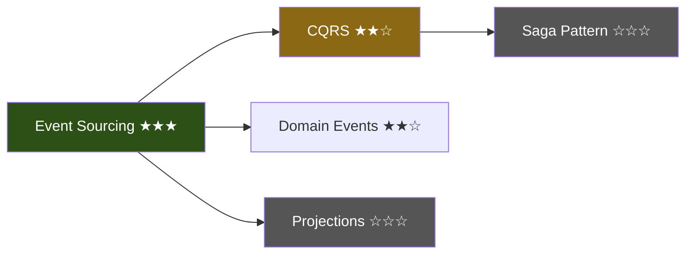

# Neocortex 技术架构

> 本文档记录已实现的技术架构设计。产品方向见 [VISION.md](VISION.md)，竞品分析和理论基础见 [RESEARCH.md](RESEARCH.md)。

---

## 1. 现状与差距

### Neocortex 已有

| 能力 | 对应模块 | 状态 |
|---|---|---|
| 内容摄取（URL/PDF/EPUB/微信） | `reader/fetcher.py` | ✅ |
| 个性化笔记生成 | `reader/teacher.py` | ✅ |
| Obsidian 兼容输出 | `cmd_read.py` (frontmatter + Mermaid) | ✅ |
| 全文搜索 + 向量检索 | `search.py` (FTS5 + fastembed) | ✅ |
| 个性化问答 | `asker.py` (ask/chat) | ✅ |
| 闭环追踪 | `tracker.py` + `config.py` | ✅ |
| 学习路径推荐 | `recommender.py` | ✅ |
| 认知收敛 | `converger.py` | ✅ |
| 视觉卡片 | `reader/card.py` | ✅ |
| 技能校准 | `prober.py` + calibration | ✅ |

### Karpathy 工作流的实现状态

| 能力 | 状态 | 对应模块 |
|---|---|---|
| **概念编译层** — 跨笔记聚合为互联的概念 wiki | ✅ 已实现 | `compiler.py` + `cmd_compile.py` |
| **知识索引** — LLM 自维护的语义目录 | ✅ 已实现 | `compiler.py`（INDEX.md 生成） |
| **问答沉淀** — ask/chat 输出回流知识库 | ✅ 已实现 | `cmd_knowledge.py`（insights/） |
| **知识健康检查** — 矛盾检测、覆盖分析、连接发现 | ✅ 已实现 | `linter.py` + `cmd_lint.py`（7 项检查） |
| **丰富输出** — 概念图可视化、学习周报 | ✅ 已实现 | `cmd_visualize.py`（map + digest） |

---

## 2. 设计目标

1. **知识 > 笔记**：单篇笔记是原材料，概念条目才是知识资产
2. **增量编译**：每次 `read` 后自动更新受影响的概念，不需要手动触发全量编译
3. **零手工维护**：INDEX.md、概念条目、双向链接全由 LLM 写和维护，用户只需阅读
4. **与已有系统深度集成**：概念 = gap 的知识化身，编译结果直接驱动推荐和校准
5. **Obsidian 原生**：所有产出都是纯 Markdown + wikilinks，Obsidian 图谱视图直接可用
6. **渐进增强**：不改变现有工作流，新功能是叠加而非替换

---

## 3. 架构概览

```
┌──────────────────────────────────────────────────────────────────┐
│  入口层                                                            │
│  CLI（Typer）            HTTP / WebSocket（FastAPI，Sprint 0）     │
│  cmd_*.py                cmd_serve.py → server/app.py             │
└──────────┬───────────────────────────┬───────────────────────────┘
           │                           │
           │              ┌────────────▼────────────┐
           │              │  services/*.py            │
           │              │  纯函数包装层（无 Rich/    │
           │              │  Typer）— HTTP/GUI 入口   │
           │              └────────────┬────────────┘
           │                           │
┌──────────▼───────────────────────────▼───────────────────────────┐
│                      用户工作流                                    │
│  read → compile → ask/chat → lint → recommend → read              │
│         ↑ 自动      ↑ 沉淀     ↑ 健康                              │
└──────┬──────────────┬─────────┬───────────────────────────────────┘
       │              │         │
┌──────▼──────┐ ┌─────▼───┐ ┌──▼───────────┐
│   编译引擎   │ │ 沉淀引擎 │ │   健检引擎    │
│ compiler.py │ │ (扩展    │ │  linter.py   │
│             │ │  asker)  │ │  verifier.py │
└──────┬──────┘ └─────┬───┘ └──────────────┘
       │              │
┌──────▼──────────────▼──────────────────────┐
│              知识库（笔记目录）                │
│  *.md          笔记                          │
│  concepts/     概念条目                       │
│  insights/     问答沉淀                       │
│  INDEX.md      语义目录                       │
│  _reports/     lint/verify 报告               │
└────────────────────────────────────────────┘
       │
┌──────▼──────────────────────────┐
│   已有系统                       │
│  gap_progress.json              │ ← 概念证据驱动 gap 状态迁移
│  recommendations.json           │ ← 概念覆盖率影响推荐
│  neocortex.sqlite               │ ← FTS5 + 向量索引
│  profile.json                   │ ← 概念掌握度更新 skills
│  server.{pid,port,token}        │ ← GUI 服务发现（serve 运行时）
└─────────────────────────────────┘
```

**服务层分工**：CLI 路径（`cmd_*.py`）直接调引擎；HTTP 路径走 `services/*.py`
（去掉 Rich/Typer/Prompt，便于 server 复用）。两条路径共享同一组底层引擎
（clipper/compiler/asker/...）。详见 [SERVER.md](SERVER.md)。

### 目录结构变化

```
~/Documents/Neocortex/          （笔记目录，现有 + 新增）
├── INDEX.md                    # 新增：LLM 自维护的知识地图
├── *.md                        # 现有：阅读笔记（不动）
├── concepts/                   # 新增：概念条目
│   ├── event-sourcing.md
│   ├── cqrs.md
│   └── ...
└── insights/                   # 新增：问答沉淀
    ├── 2026-04-03-crdt-vs-ot.md
    └── ...
```

---

## 4. 详细设计

### 4.1 概念编译层（`compiler.py`，新增命令 `neocortex compile`）

**核心思路**：扫描所有笔记，提取概念，为每个概念生成一个 wiki 条目，建立双向链接。

#### 4.1.1 概念提取

从每篇笔记中提取概念列表。一次 LLM 调用处理一篇笔记：

```
输入：笔记内容（前 3000 字）+ frontmatter tags
输出：[{name, definition_brief, relationship_to: [other_concepts]}]
```

概念名称经过 `normalize_gap_name()` 规范化（复用现有 gap 同义词系统），确保 "Event Sourcing"、"event sourcing"、"ES" 都归一为同一个概念。

#### 4.1.2 概念条目格式

```markdown
---
type: concept
name: Event Sourcing
aliases: [event-sourcing, ES, 事件溯源]
related_concepts: [CQRS, Domain Events, Event Store]
skill_level: proficient
confidence: 0.6
evidence_count: 5
last_updated: 2026-04-03
---

# Event Sourcing

## 一句话理解
不存最终状态，只存每一步变化——就像 git log 比 working tree 更有价值。

## 核心要点
- [从多篇笔记聚合的关键知识点]
- [跨笔记出现的共识和分歧]

## 来源笔记
- [[event-sourcing-explained-2026-03-15]] — 基础介绍，Martin Fowler 的定义
- [[building-event-stores-2026-03-20]] — 实现细节，PostgreSQL 方案
- [[microservices-patterns-2026-03-25]] — 在微服务中的应用

## 关联概念
- [[CQRS]] — 常配合使用，读写分离
- [[Domain Events]] — 事件溯源的基本单元
- [[Saga Pattern]] — 跨服务事务补偿

## 开放问题
- Event Store 的快照策略？多久打一次？
- 与传统 CRUD 的渐进迁移路径？

## 从你的项目看
- 你在 neocortex 项目中用了类似思路：profile 变更不是覆盖写入，而是通过 gap_progress 追踪状态变迁
```

#### 4.1.3 编译模式

**增量编译**（每次 `read` 后自动触发）：

```
新笔记写入
  → 提取该笔记涉及的概念（1 次 LLM 调用）
  → 对每个概念：
     ├─ 已有条目 → 追加来源笔记、更新要点（1 次 LLM 调用 / 概念）
     └─ 新概念 → 创建条目（1 次 LLM 调用）
  → 更新 INDEX.md 中对应的条目行
  → 在笔记中插入 [[wikilinks]]
```

**全量编译**（`neocortex compile`，手动触发）：

```
扫描所有笔记 + insights
  → 批量提取概念（可合并多篇笔记到一次调用）
  → 重新生成所有概念条目
  → 发现跨概念关系
  → 重建 INDEX.md
  → 全量插入 wikilinks
```

**编译缓存**：在 `~/.neocortex/compile_cache.json` 存储每篇笔记的 content hash。增量编译时只处理 hash 变化的笔记。全量编译忽略缓存。

#### 4.1.4 Wikilink 插入策略

在笔记正文中，将概念名称（及其别名）替换为 `[[概念名称]]` 格式。规则：

- 只替换首次出现（避免满篇链接）
- 不替换代码块、frontmatter、标题中的文本
- 使用概念的 `aliases` 列表做匹配
- 插入后笔记仍然是合法 Markdown（Obsidian 渲染 wikilinks，普通编辑器显示为 `[[text]]`）

#### 4.1.5 与 gap 系统集成

概念条目和 gap 是同一事物的两面：

```
gap（画像中的盲区） ←→ concept（知识库中的条目）
```

映射规则：
- 概念的 `evidence_count`（来源笔记数）驱动 gap 状态迁移：
  - 0 篇笔记 → gap
  - 1-2 篇笔记 → learning
  - 3+ 篇笔记且通过 Socratic probe → known
- 概念的 `skill_level` 和 `confidence` 同步到 profile 对应的 skill
- 新发现的概念如果不在 gap 列表中 → 新增为 gap（状态为 "learning"，因为已有一篇笔记）

这让现有的闭环（recommend → read → track gap）多了一条通路：概念积累自动推进 gap 状态，不再完全依赖 tracker 的手动匹配。

---

### 4.2 知识索引（`INDEX.md`）

LLM 自维护的知识地图。这是 Karpathy 发现的关键洞察：**不需要复杂 RAG，LLM 维护的索引文件 + 每篇文档的简要摘要就够了**。

#### 4.2.1 INDEX.md 格式

```markdown
# Knowledge Base

> 42 notes | 15 concepts | 8 insights | Last updated: 2026-04-03

## Concept Map

### 分布式系统
- [[Event Sourcing]] ★★★ — 5 notes — 不存状态存变化
- [[CQRS]] ★★☆ — 2 notes — 读写模型分离
- [[Saga Pattern]] ☆☆☆ — 0 notes — 跨服务事务（待探索）

### 前端工程
- [[React Server Components]] ★☆☆ — 1 note — 服务端渲染组件
- [[Streaming SSR]] ☆☆☆ — 0 notes — 流式服务端渲染（待探索）

### AI/ML
- [[RAG]] ★★☆ — 3 notes — 检索增强生成
- [[Fine-tuning]] ★☆☆ — 1 note — 模型微调

## Recent Activity
- 2026-04-03: 阅读「Event Sourcing in Practice」→ 更新 [[Event Sourcing]]、新建 [[Event Store]]
- 2026-04-02: 问答「CRDT vs OT 的取舍」→ 保存为 insight
- 2026-04-01: 阅读「React 19 新特性」→ 新建 [[React Server Components]]

## Coverage Summary
- 15 concepts total: 4 mastered, 6 learning, 5 gaps
- 3 domains active: 分布式系统 (7), 前端 (5), AI/ML (3)
- Strongest cluster: 分布式系统 — 形成了 Event Sourcing → CQRS → Saga 的知识链
- Weakest gap: Streaming SSR — 出现在 3 篇笔记中但没有专门学习
```

#### 4.2.2 更新策略

- 增量编译时：只更新受影响的概念行 + Recent Activity
- 全量编译时：重新生成整个文件
- INDEX.md 的星级（★）反映 gap 状态：★★★ = known, ★★☆ = learning, ★☆☆ = 有笔记但未掌握, ☆☆☆ = gap

#### 4.2.3 用于增强问答

现有 `ask`/`chat` 的问答只用了 profile 做上下文。增强后：

```
用户提问
  → 读 INDEX.md，定位相关概念
  → 读取相关概念条目（每个条目很短，1-2KB）
  → 如果需要更多细节，读取概念链接的具体笔记
  → 带着完整知识上下文生成回答
```

这就是 Karpathy 说的 "LLM 在 ~100 篇文章规模下不需要 RAG"——INDEX.md 就是导航图，概念条目是摘要层，具体笔记是原始层。三层结构让 LLM 高效定位信息。

---

### 4.3 问答沉淀

**目标**：`ask`/`chat` 的有价值回答不再消失在终端里，而是沉淀为知识库的一部分。

#### 4.3.1 `ask` 命令扩展

```python
# 现有行为：打印回答后结束
# 新增行为：
#   1. 打印回答
#   2. 提示 "Save to knowledge base? [y/n/auto]"
#   3. 如果 yes → 保存为 insights/*.md
#   4. 触发增量编译
```

新增 `--save` flag 跳过确认直接保存。新增配置项 `auto_save_insights: bool = False`，开启后自动保存所有问答。

#### 4.3.2 `chat` 命令扩展

Chat session 结束时：

```python
# 现有行为：直接退出
# 新增行为：
#   1. 统计对话中有价值的问答对（排除闲聊）
#   2. 如果有价值内容 > 0，提示 "Save N insights? [y/n]"
#   3. 保存为 insights/*.md（一个对话一个文件，或每个问答对一个文件）
#   4. 触发增量编译
```

#### 4.3.3 Insight 文件格式

```markdown
---
type: insight
question: "CRDT 和 OT 在协同编辑中怎么选？"
date: 2026-04-03
source: ask
related_concepts: [CRDT, OT, Collaborative Editing]
tags:
  - distributed-systems
  - real-time-collaboration
---

# CRDT 和 OT 在协同编辑中怎么选？

[LLM 生成的回答内容]

## 关键结论
- [从回答中提取的核心要点]
```

Insight 参与概念编译（和普通笔记一样），但在 INDEX.md 中标记来源为 "探索" 而非 "阅读"。

---

### 4.4 知识健康检查（`linter.py`，新增命令 `neocortex lint`）

**目标**：让 LLM 对整个知识库做质检，发现问题、补全缺失、挖掘关联。

#### 4.4.1 检查项

| 检查类型 | 说明 | 实现方式 |
|---|---|---|
| **矛盾检测** | 同一概念在不同笔记中的冲突说法 | LLM 对比同概念下的多篇笔记摘要 |
| **孤岛笔记** | 没有关联到任何概念的笔记 | 扫描笔记，检查是否有 wikilinks 或 tags 匹配概念 |
| **陈旧概念** | 概念条目的来源笔记已更新但条目未同步 | 比较笔记 mtime 和概念 last_updated |
| **缺失连接** | 两个概念频繁共现于同一笔记但未建立关联 | 统计概念共现矩阵，找高共现但未 link 的对 |
| **覆盖盲区** | 用户有 gap 但没有任何笔记覆盖该领域 | 交叉比对 profile.gaps 和概念条目 |
| **深度不足** | 概念有多篇笔记但都是浅层（outline 全是 brief） | 检查笔记的 outline marker 分布 |
| **断裂链接** | wikilinks 指向不存在的文件 | 扫描所有 `[[...]]`，检查目标文件存在性 |
| **重复概念** | 同一概念以不同名字出现 | 复用 `_GAP_SYNONYMS` + LLM 语义去重 |
| **建议探索** | 基于已有概念发现值得探索的交叉领域 | LLM 分析概念图谱，提出"你学了 X 和 Y，它们的交集 Z 值得看看" |

#### 4.4.2 输出格式

```
$ neocortex lint

  Knowledge Base Health Report
  ━━━━━━━━━━━━━━━━━━━━━━━━━━━━━━━━━━━━━━━━━━━━━

  Score: 72/100

  ❌ Contradictions (2)
     • Event Sourcing: 笔记 A 说 "快照每 100 事件打一次"，笔记 B 说 "快照在查询时按需生成"
       → 建议：阅读 Greg Young 的原始论文确认

  ⚠️ Orphan Notes (3)
     • python-tips-2026-03-10.md — 无关联概念
     • ...

  ⚠️ Coverage Gaps (4)
     • Streaming SSR — 出现在 3 篇笔记中但没有专门条目
     • WebSocket — profile 中标为 gap，知识库中零覆盖

  💡 Suggested Explorations (2)
     • 你学了 Event Sourcing 和 CQRS，但没探索过 Projection Rebuilding
     • CRDT 和 Saga Pattern 都涉及最终一致性，值得对比研究

  ✅ Healthy (8)
     • 15 concepts all have sources
     • No broken wikilinks
     • ...
```

#### 4.4.3 自动修复

`lint` 默认只报告。加 `--fix` flag 自动修复可修的问题：

- 断裂链接 → 删除或创建空概念条目
- 陈旧概念 → 触发增量重编译
- 孤岛笔记 → 尝试提取概念并建立链接
- 重复概念 → 合并（需用户确认）

矛盾检测和建议探索只报告，不自动修复——这些需要用户判断。

#### 4.4.4 与 converge 的关系

现有 `converge` 命令关注的是"这段时间我学了什么，有什么交叉和盲区"——是**时间维度**的总结。

新增 `lint` 关注的是"我的整个知识库健康吗"——是**空间维度**的质检。

两者互补，不替代。长远来看，`lint` 的发现可以作为 `converge` 报告的输入，让收敛报告更准确。

---

### 4.5 增强输出格式

#### 4.5.1 概念图可视化（`neocortex map`）

生成知识库的概念关系图（Mermaid 格式），输出为 Markdown 文件：



支持参数：
- `neocortex map` — 全局概念图
- `neocortex map --domain "分布式系统"` — 按领域筛选
- `neocortex map --around "Event Sourcing"` — 某概念的关联网络

输出为 `~/Documents/Neocortex/maps/concept-map-YYYY-MM-DD.md`，Obsidian 可直接渲染。

#### 4.5.2 学习周报（`neocortex digest`）

在现有 `converge` 的基础上增加结构化输出：

```markdown
# 学习周报 2026-W14

## 本周数据
- 阅读：5 篇文章
- 新概念：3 个（Event Store, Projection, Snapshot）
- 概念升级：Event Sourcing gap → learning → known ✓
- 问答探索：2 次
- 知识库健康：72/100 → 78/100

## 知识网络变化
[Mermaid diff 图：本周新增的概念和连接高亮]

## 本周洞察
[从 converge 引擎生成]

## 下周建议
[从 lint 的 suggested explorations + recommender 生成]
```

#### 4.5.3 Slides 导出（`neocortex slides`，P2）

将概念条目或笔记转为 Marp 格式的 slides：

```markdown
---
marp: true
theme: default
---

# Event Sourcing

不存最终状态，只存每一步变化

---

## 核心原理

- 每个状态变更 = 一个不可变事件
- 当前状态 = 所有事件的累积
- 类比：git log > working tree

---

## 从你的项目看

Neocortex 的 gap_progress 就是简化版 Event Sourcing：
- 每次 read 是一个事件
- gap → learning → known 是状态重建

---
```

Obsidian 的 Marp 插件可直接渲染和演示。

---

## 5. 与现有系统的集成

### 5.1 `read` 命令（`cmd_read.py`）

**改动点**：在笔记保存和索引之后，增加编译步骤。

```python
# 现有流程（不变）：
#   fetch → outline → generate_notes → save → index → match_recommendation → feedback

# 新增步骤（在 index 之后）：
#   → compile_note(note_path)  # 提取概念、更新/创建条目、更新 INDEX.md
```

用户无感知，编译在后台完成。如果编译失败（LLM 错误等），不影响现有流程，只是这篇笔记的概念未被提取。下次 `neocortex compile` 全量编译时会补上。

### 5.2 `ask`/`chat` 命令（`cmd_knowledge.py`）

**改动点**：

1. **问答增强**：在构建 system prompt 时，加载 INDEX.md + 相关概念条目作为上下文
2. **沉淀**：回答后提供保存选项
3. **保存后触发增量编译**

```python
# 现有 ask 流程：
#   load_profile → create_provider → ask_question(question, profile) → print

# 增强后：
#   load_profile → create_provider
#   → load INDEX.md + 相关概念（新增）
#   → ask_question(question, profile, knowledge_context)  # 签名变化
#   → print
#   → prompt save? → save_insight() → compile_note()  # 新增
```

### 5.3 `recommend` 命令（`cmd_learn.py`）

**改动点**：推荐上下文增加知识库状态。

```python
# 现有 _build_context() 包含：persona, gaps, completed, recently_read
# 新增：concept_coverage — 每个概念的掌握度和笔记数量
```

这让推荐器知道"用户虽然还没完成推荐，但已经自己读了相关文章"，避免重复推荐。

### 5.4 `converge` 命令（`cmd_learn.py`）

**改动点**：收敛报告的输入增加概念图谱信息。

```python
# 现有输入：recent notes
# 新增输入：concepts 目录下的条目、INDEX.md 的 coverage summary
```

这让收敛报告能说"你在分布式系统领域形成了 3 个概念的知识链"，而不只是"你读了 5 篇文章"。

### 5.5 `index` 命令

**改动点**：索引范围扩展到 `concepts/` 和 `insights/` 目录。

现有的 `notes_dir.rglob("*.md")` 已经能覆盖子目录，只需确认 `concepts/` 和 `insights/` 下的文件不会被 `"diagrams" not in f.parts` 过滤掉（不会，因为目录名不是 "diagrams"）。

### 5.6 `notes` 命令

**改动点**：列表展示区分笔记/概念/洞察。

```
  File                                    Type      Date        Size
  event-sourcing-explained-2026-03-15.md  note      2026-03-15  4.2 KB
  concepts/event-sourcing.md              concept   2026-04-03  2.1 KB
  insights/crdt-vs-ot-2026-04-03.md       insight   2026-04-03  1.5 KB
```

---

## 6. 新增模块设计

### 6.1 `compiler.py` — 编译引擎

```python
# 公开接口：
async def compile_note(note_path: Path, provider: LLMProvider, notes_dir: Path) -> list[str]
    """增量编译一篇笔记。返回受影响的概念名称列表。"""

async def compile_all(notes_dir: Path, provider: LLMProvider, on_progress=None) -> CompileResult
    """全量编译。返回统计信息。"""

async def extract_concepts(content: str, provider: LLMProvider) -> list[ConceptRef]
    """从文本中提取概念列表。"""

async def generate_concept_entry(name: str, sources: list[SourceNote], provider: LLMProvider, profile: Profile) -> str
    """生成或更新一个概念条目的 Markdown 内容。"""

def update_index(notes_dir: Path, concepts: list[ConceptInfo], profile: Profile) -> None
    """重新生成 INDEX.md。"""

def insert_wikilinks(content: str, concepts: list[str]) -> str
    """在文本中插入 [[wikilinks]]。"""
```

### 6.2 `linter.py` — 健康检查引擎

```python
# 公开接口：
async def lint_knowledge_base(notes_dir: Path, profile: Profile, provider: LLMProvider) -> LintReport
    """运行所有检查，返回报告。"""

async def fix_issues(report: LintReport, notes_dir: Path, provider: LLMProvider) -> list[str]
    """自动修复可修的问题。返回修复描述列表。"""

# 检查项注册：
CHECKS: list[LintCheck] = [
    check_contradictions,
    check_orphan_notes,
    check_stale_concepts,
    check_missing_connections,
    check_coverage_gaps,
    check_depth,
    check_broken_links,
    check_duplicate_concepts,
    check_suggested_explorations,
]
```

### 6.3 数据模型新增（`models.py`）

```python
class ConceptRef(BaseModel):
    """从笔记中提取的概念引用。"""
    name: str
    definition_brief: str = ""
    related_to: list[str] = Field(default_factory=list)

class ConceptEntry(BaseModel):
    """概念条目的元数据（frontmatter 解析）。"""
    name: str
    aliases: list[str] = Field(default_factory=list)
    related_concepts: list[str] = Field(default_factory=list)
    skill_level: SkillLevel = SkillLevel.BEGINNER
    confidence: float = 0.3
    evidence_count: int = 0
    last_updated: str = ""
    source_notes: list[str] = Field(default_factory=list)

class LintIssue(BaseModel):
    """一个健康检查问题。"""
    type: str  # contradiction, orphan, stale, missing_link, coverage_gap, ...
    severity: str = "warning"  # error, warning, info
    message: str
    details: str = ""
    auto_fixable: bool = False

class LintReport(BaseModel):
    """完整的健康检查报告。"""
    score: int = 0  # 0-100
    issues: list[LintIssue] = Field(default_factory=list)
    stats: dict[str, int] = Field(default_factory=dict)  # notes_count, concepts_count, etc.

class CompileResult(BaseModel):
    """编译结果统计。"""
    notes_processed: int = 0
    concepts_created: int = 0
    concepts_updated: int = 0
    wikilinks_inserted: int = 0
    index_updated: bool = False
```

### 6.4 新增 CLI 命令

```python
@app.command()
def compile(full: bool = typer.Option(False, "--full", help="Full recompilation")) -> None:
    """Compile notes into a linked concept wiki."""

@app.command()
def lint(fix: bool = typer.Option(False, "--fix", help="Auto-fix issues")) -> None:
    """Run health checks on your knowledge base."""

@app.command()
def map(
    domain: str = typer.Option(None, help="Filter by domain"),
    around: str = typer.Option(None, help="Show neighborhood of a concept"),
) -> None:
    """Generate a visual concept map."""

@app.command()
def digest(days: int = typer.Option(7, help="Period in days")) -> None:
    """Generate a learning digest for the period."""
```

---

## 7. LLM 调用优化

概念编译会增加 LLM 调用量，需要控制成本：

| 操作 | LLM 调用次数 | 优化手段 |
|---|---|---|
| 增量编译 1 篇笔记 | 1（提取概念）+ N（更新 N 个概念条目）| 概念条目更新可批量（多个概念合并到 1 次调用） |
| 全量编译 100 篇笔记 | 合并：~20 次（每次 5 篇笔记）+ ~30 次（概念条目生成）| 并发执行、缓存 hash 跳过未变化的 |
| lint 全量检查 | ~5 次（矛盾检测按概念分组）+ ~3 次（建议探索等高层分析）| 纯文件扫描的检查（孤岛、断链）不需要 LLM |
| 增强问答 | 0 额外（INDEX.md 和概念条目是文件读取，不是 LLM 调用）| — |

**关键优化**：
1. **编译缓存**：content hash 不变则跳过
2. **批量调用**：多篇笔记的概念提取合并到一次 LLM 调用
3. **异步并发**：多个概念条目的生成/更新并发执行
4. **分层读取**：问答时先读 INDEX.md（小文件），再按需读概念条目，最后才读完整笔记
5. **纯文件检查前置**：lint 中不需要 LLM 的检查先跑，快速给出部分结果

---

## 8. 实现计划

### Phase 1: 概念编译 + 知识索引（核心）

1. `models.py` — 新增 ConceptRef、ConceptEntry、CompileResult 等模型
2. `compiler.py` — 编译引擎：概念提取、条目生成、wikilink 插入、INDEX.md 生成
3. `cmd_read.py` — 在 read 流程末尾接入增量编译
4. CLI `compile` 命令 — 全量编译入口
5. `search.py` — 扩展索引范围到 concepts/ 和 insights/

### Phase 2: 问答沉淀 + 问答增强

6. `asker.py` — 问答上下文增加知识库信息（INDEX.md + 概念条目）
7. `cmd_knowledge.py` — ask/chat 增加保存提示和 --save flag
8. insight 保存逻辑 + 触发增量编译

### Phase 3: 健康检查

9. `linter.py` — 健检引擎：9 项检查 + --fix 自动修复
10. CLI `lint` 命令
11. 与 converge 集成——lint 发现作为收敛报告输入

### Phase 4: 可视化增强

12. CLI `map` 命令 — Mermaid 概念图
13. CLI `digest` 命令 — 学习周报
14. recommender 上下文增加概念覆盖率
15. slides 导出（Marp 格式）

---

## 9. 与 Karpathy 工作流的最终对比

| Karpathy | Neocortex (实现后) | Neocortex 的优势 |
|---|---|---|
| 手动收集 raw 文件 | `neocortex read <url>` 一键摄取 | 自动 fetch + 格式转换 |
| LLM 编译 wiki | `neocortex compile` + read 自动增量编译 | 增量编译 + 编译缓存 |
| Obsidian 查看 | 原生 Obsidian 兼容 | 完全一致 |
| 自己写 prompt 问答 | `neocortex ask/chat`（带知识库上下文） | 自动加载相关概念，个性化到用户水平 |
| 手动 file 回 wiki | 自动沉淀（ask --save, chat 退出时保存） | 零手工 |
| 自己写 lint 脚本 | `neocortex lint` | 9 项结构化检查 + auto-fix |
| 无 | 闭环学习（recommend → read → track → re-recommend） | **独有** |
| 无 | 技能校准（Socratic probe + calibration） | **独有** |
| 无 | 学习路径依赖（step + depends_on） | **独有** |
| 无 | 概念-gap 联动（编译驱动 gap 状态迁移） | **独有** |

**Karpathy 在用脚本拼出一个原型。Neocortex 要把它做成产品。**

---

